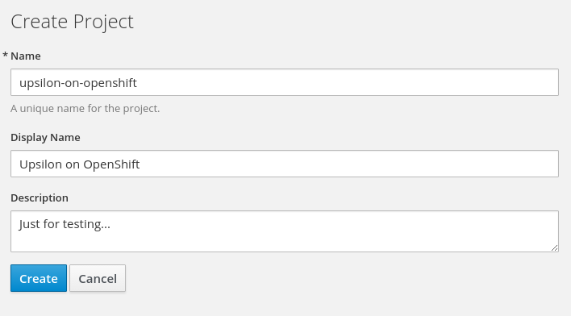
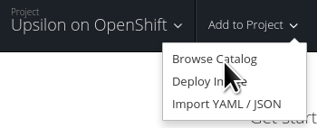
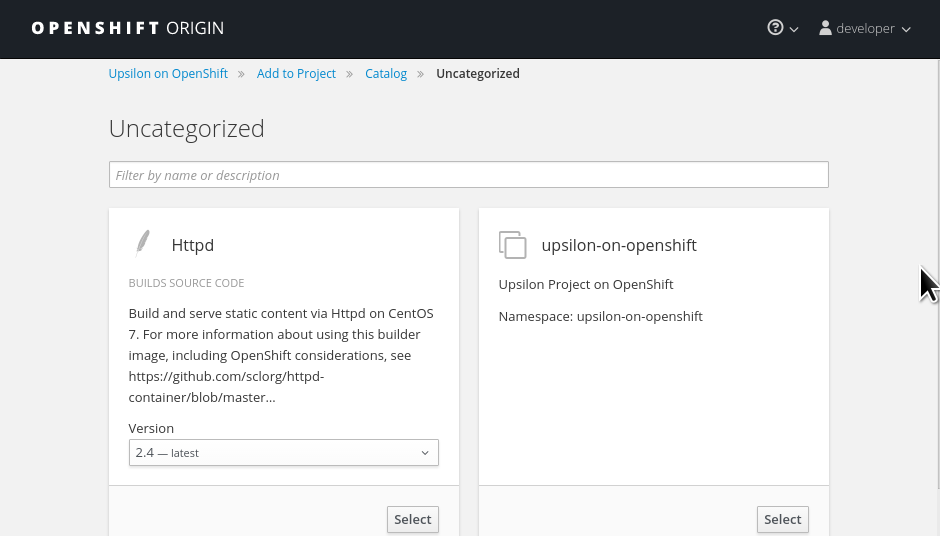
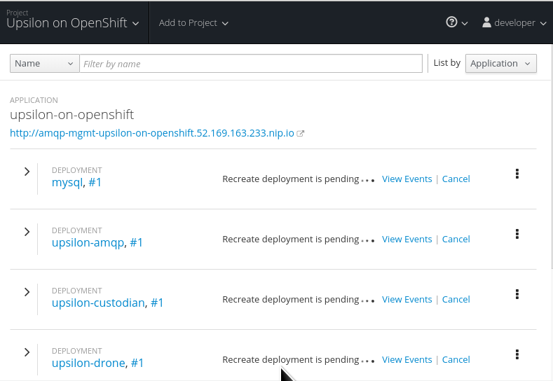

Upsilon can be deployed quite easily on top of OpenShift 3 - all it's services 
dockerized/containerized. You can scale-out of the OpenShift environment and deploy
upsilon-drone and other services outside too. 

This article addumes you have a OpenShift 3 environment up and running, and
have a fairly reasonable quota. 

# Create a OpenShift project for contain Upsilon. 

Call it anything you like!

# Upload the Upsilon application template to OpenShift

There is a pre-built Upsilon application template for OpenShift, stored in a
GitHub repository called [upsilon-ose3-template](https://github.com/upsilonproject/upsilon-ose3-template).

Login to OpenShift using the command line tool and upload the application
template. 

	<code>
	 oc status 
	In project Upsilon on OpenShift (upsilon-on-openshift) on server https://jread-openshift-allinone.northeurope.cloudapp.azure.com:8443  

	You have no services, deployment configs, or build configs. 
	Run 'oc new-app' to create an application. 

	 oc create -f upsilon-on-openshift.yaml 
	....
	</code>

The application template should complete successfully, and you should be able
to browse and find Upsilon in the OpenShift catalog;

You can change some of the deployment options before starting the deployment,
but the defaults are fine.

# Create a OpenShift project for contain Upsilon. 

