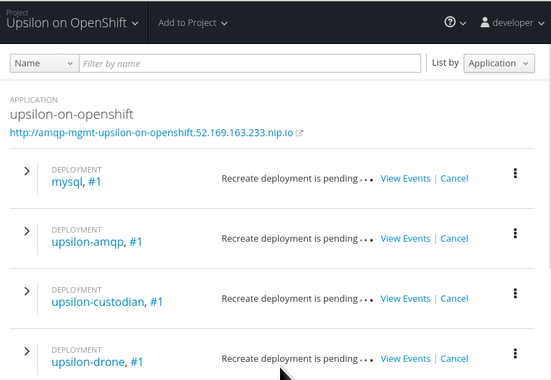

Upsilon can be deployed quite easily on top of OpenShift 3 - all it's services 
dockerized/containerized. You can scale-out of the OpenShift environment and deploy
upsilon-drone and other services outside too. 

This article assumes you have a OpenShift 3 environment up and running, and
have a fairly reasonable quota. 

### Create a OpenShift project for Upsilon

Call it anything you like!

### Upload the Upsilon application template to OpenShift

There is a pre-built Upsilon application template for OpenShift, stored in a
GitHub repository called [upsilon-on-openshift](https://github.com/upsilonproject/upsilon-on-openshift). 

On your local workstation, clone this repository:

	<code>
	 <strong>mkdir upsilon-sandbox && cd upsilon-sandbox</strong> 
	 <strong>git clone https://github.com/upsilonproject/upsilon-on-openshift.git</strong> 
	 <strong>cd upsilon-on-openshift</strong>
	</code>

Login to OpenShift using the command line tool and upload the application
template. 

	<code>
	 <strong>oc status</strong> 
	In project Upsilon on OpenShift (upsilon-on-openshift) on server https://openshift.example.com:8443  

	You have no services, deployment configs, or build configs. 
	Run 'oc new-app' to create an application. 

	 <strong>oc create -f upsilon-on-openshift.yaml</strong> 
	....
	</code>

The application template should complete successfully, and you should be able
to browse and find Upsilon in the OpenShift catalog;

You can change some of the deployment options before starting the deployment,
but the defaults are fine.

### Import the schema and the initial database

From this overview screen, you'll want to wait for the upsilon-web pod to come up
sucessfully. This may take a couple of minutes. 

Create the initial database using the create-database script.

    <code>
	 <strong>cd /usr/share/upsilon-database/mysql/</strong> 
	 <strong>./create-database</strong> 
    </code>

### Go to the web application

Click on the upsilon-web route to start the installer.
